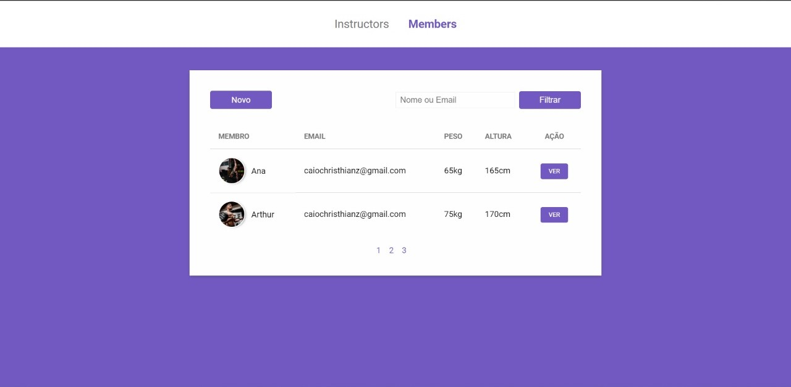
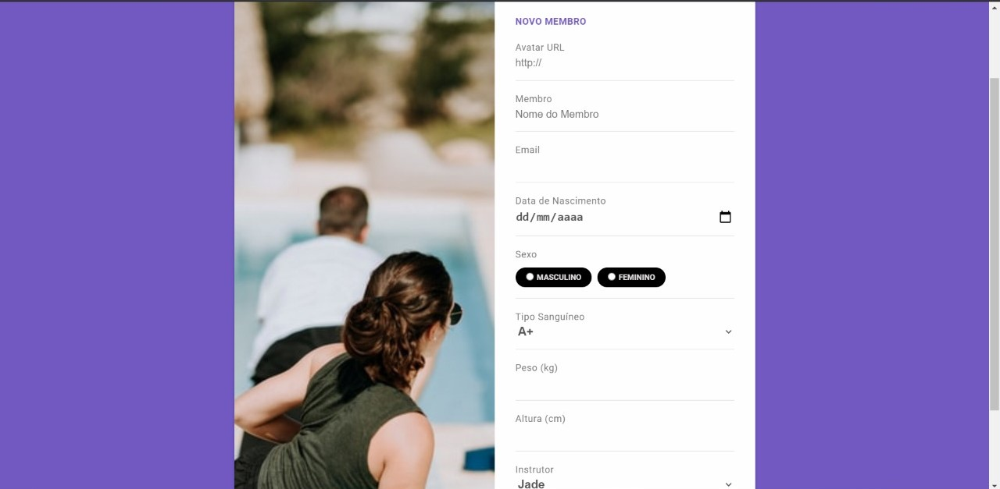
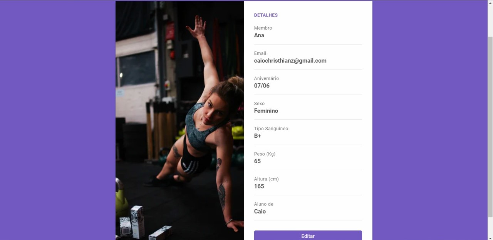
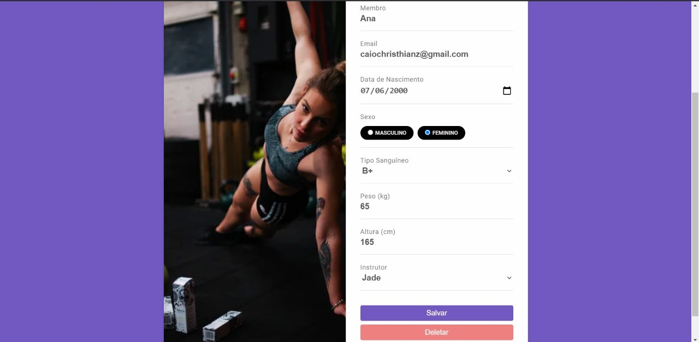

<h1 align="center">
    First Project 
</h1>

  <a href="#-tecnologias">Tecnologias</a>&nbsp;&nbsp;&nbsp;|&nbsp;&nbsp;&nbsp;
  <a href="#-projeto">Projeto</a>&nbsp;&nbsp;&nbsp;|&nbsp;&nbsp;&nbsp;

 

Instructors

  

 

Members

  

 

Create

  

 

Show

  

 

Edit

  

## 🚀 Tecnologias

Esse projeto foi desenvolvido com as seguintes tecnologias:

- HTML
- CSS
- JavaScript
- NodeJS
- Express
- Nunjucks

## 💻 Projeto

Este projeto foi feito para treinar minhas skills em programação.
